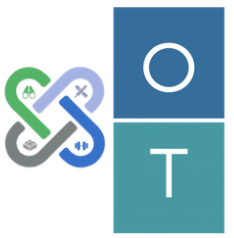

<h1>
  
  OmniTransform

</h1>

## OmniTransform Overview:
OmniTransform is a highly configurable framework that ingests and transforms large amounts of data and creates output in many formats (for example : JSON, Parquet, flat file).
It uses spark internally which has various benefits like dynamic in nature, in-memory computation, fault tolerant, and can be integrated with various data systems like Hadoop, databases, 
Kafka and many more.Spark achieves high performance for both batch and streaming data. It also has a custom language to describe the spark job data injections, transformations and outputs.
It is provided by the framework. Once a job is specified using JSL, it can be converted into Java code which can be then be executed on the spark cluster. JSL will allow a user to specify
one or more data source inputs, spark-sql based transformations and transformed outputs in desired file formats or other data sources.Examples of transformations are aggregations, joins, 
filters applied on the Data frames/Datasets. A valid JSL can be converted into executable spark code so that the user does not have to learn spark specifics. However, the generated code 
will be available for modification if the user chooses to override it and can provide custom implementation.

Transform Framework: It is a core library of OmniTransform framework that helps in preprocessing of the JSL (Job Specification Language ) file. 
It reads the data from the different data sources and convert them to the in-memory temporary tables. These temporary tables are utilized by framework to create transformations.

## Features 
* Configuration driven spark application development framework.

* It can be used to build batch ETL applications.
 
* It can read from various file formats (like fixed length, parquet, xml, delimited and Json), databases (relational and NOSQL) and elastic search.

* It can write to various file formats (like fixed length, parquet, xml, delimited and Json), databases (relational and NOSQL) and elastic search.
 
* It can be used to built complex transformations using spark sql. So, only sql knowledge is required to build spark jobs.

* It can be be extended using spark UDF.

## Usage

### System Requirements:
* Java 8.
 
* maven.
 
### Quick Start
* Refer to starter app in the examples folder to build applications on transform framework.
 
### Steps to Build and Run:
* Build the app by executing maven command : mvn clean install.
 
* Run the testcases by executing maven command : mvn test.
 
### UDF Design guidelines:
* Implement the OmniTransformUDF interface to register UDF.

	example: catalog.register("<Custom_UdfName>",<UDF_Method> , <ReturnType_Of_UDF>).
    
* Determine the number of input parameters & their data types.

* Select the appropriate UDF Function (UDF1, UDF2, etc.) class to override. 

* Determine the return type from the UDF function.

* It should have focused functionality which can be tested using a unit test.

* Add any required dependencies to the POM file.

### UDF Testing:
* In the JSL transform step that requires a UDF, use the additional properties to specify the UDF class to use.

	example: "additionalProperties":{"udf":["com.americanexpress.omnitransform.udf.YourUDFClass"]}.
  
* Use UDF as a part of select sql in Transform section of JSL.
  
  	example: "Select YourUDF(UDFParameter) from Table".
  
* Validate the output.

## Steps to contribute:
* Refer the CONTRIBUTING.md file.
 
## Contacts
* Please <a href="mailto:onetransformteam@aexp.com">Send email</a> for any enquiries.
 
## Contributing
We welcome Your interest in the American Express Open Source Community on Github. Any Contributor to
any Open Source Project managed by the American Express Open Source Community must accept and sign
an Agreement indicating agreement to the terms below. Except for the rights granted in this 
Agreement to American Express and to recipients of software distributed by American Express, You
reserve all right, title, and interest, if any, in and to Your Contributions. Please
[fill out the Agreement](https://cla-assistant.io/americanexpress/omnitransform).
## License

Any contributions made under this project will be governed by the
[Apache License 2.0](./LICENSE.txt).
## Code of Conduct

This project adheres to the [American Express Community Guidelines](./CODE_OF_CONDUCT.md). By
participating, you are expected to honor these guidelines.
